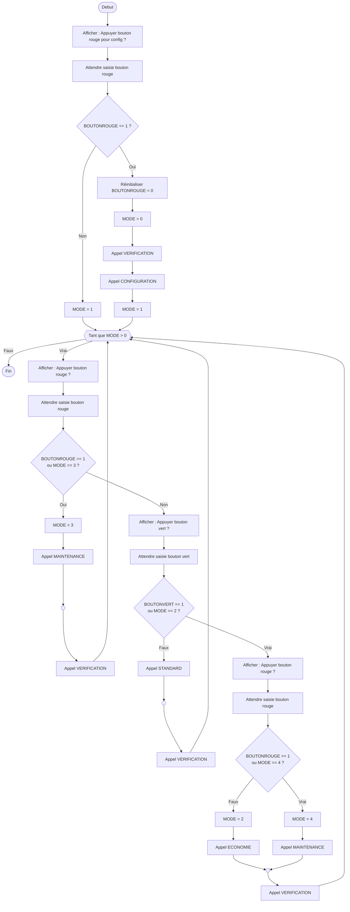
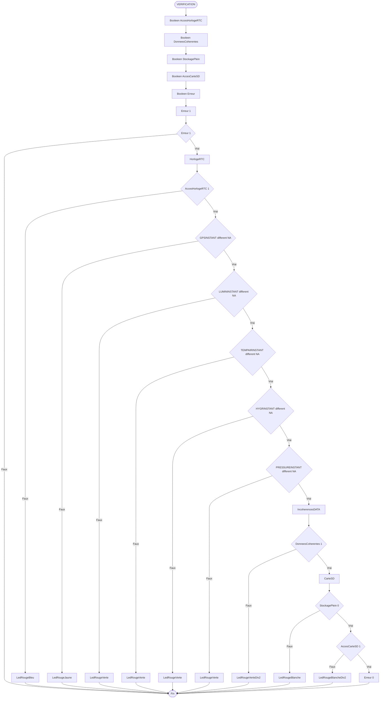

## MAIN (à compléter)

```mermaid
flowchart TD

%% =====================
%% DEMARRAGE & CONFIG
%% =====================

START([Debut])

START --> ASK0[Afficher : Appuyer bouton rouge pour config ?]
ASK0 --> WAIT0[Attendre saisie bouton rouge]
WAIT0 --> C0{BOUTONROUGE == 1 ?}

%% Branche CONFIGURATION : Redirection vers le mode opérationnel après exécution
C0 -- Oui --> R0[Réinitialiser BOUTONROUGE = 0]
R0 --> M0[MODE = 0]
M0 --> VER0[Appel VERIFICATION]
VER0 --> CONF0[Appel CONFIGURATION]
CONF0 --> M1_AUTO[MODE = 1]

%% Branche Directe vers Standard
C0 -- Non --> M1[MODE = 1]

%% =====================
%% BOUCLE PRINCIPALE (OPERATIOUNELLE)
%% =====================

M1 --> WHILE{{Tant que MODE > 0}}
M1_AUTO --> WHILE

WHILE -- Faux --> END([Fin])
WHILE -- Vrai --> ASK1[Afficher : Appuyer bouton rouge ?]

ASK1 --> WAIT1[Attendre saisie bouton rouge]
WAIT1 --> C1{BOUTONROUGE == 1<br/>ou MODE == 3 ?}

%% ---- Branche MAINTENANCE 1
C1 -- Oui --> M3[MODE = 3]
M3 --> MAINT1[Appel MAINTENANCE]
MAINT1 --> JOIN1(( ))
JOIN1 --> VER1[Appel VERIFICATION]
VER1 --> WHILE

%% ---- Branche STANDARD / ECONOMIE
C1 -- Non --> ASK2[Afficher : Appuyer bouton vert ?]
ASK2 --> WAIT2[Attendre saisie bouton vert]
WAIT2 --> C2{BOUTONVERT == 1<br/>ou MODE == 2 ?}

%% ---- Mode STANDARD
C2 -- Faux --> STD[Appel STANDARD]
STD --> JOIN2(( ))
JOIN2 --> VER2[Appel VERIFICATION]
VER2 --> WHILE

%% ---- Mode ECONOMIE ou MAINTENANCE 4
C2 -- Vrai --> ASK3[Afficher : Appuyer bouton rouge ?]
ASK3 --> WAIT3[Attendre saisie bouton rouge]
WAIT3 --> C3{BOUTONROUGE == 1<br/>ou MODE == 4 ?}

%% Sous-branche Économie
C3 -- Faux --> M2[MODE = 2]
M2 --> ECO[Appel ECONOMIE]
ECO --> JOIN3(( ))

%% Sous-branche Maintenance via Mode Éco
C3 -- Vrai --> M4[MODE = 4]
M4 --> MAINT2[Appel MAINTENANCE]
MAINT2 --> JOIN3

%% Retour commun vers la vérification cyclique
JOIN3 --> VER3[Appel VERIFICATION]
VER3 --> WHILE
```

## Standart

```mermaid
flowchart TD

START([STANDARD])

START --> A1[LOGINTERVAL 600]
A1 --> A2[LEDVERTE = 1]
A2 --> A3[Entier InstantT]
A3 --> A4[TIMEOUT = 30]
A4 --> A5[InstantT = RTC + LOGINTERVAL]

%% =====================
%% Attente RTC
%% =====================

A5 --> W1{RTC != InstantT}
W1 -- Oui --> W1
W1 -- Non --> B1[InstantT = RTC]

%% =====================
%% GPS
%% =====================

B1 --> C1{RTC < InstantT + TIMEOUT and GPSINSTANT = 0 }
C1 -- Faux --> SAVE1[Mesures enregistrees]
C1 -- Vrai --> NA1[NA]
SAVE1 --> D1[InstantT = RTC]
NA1 --> D1

%% =====================
%% LUMIN
%% =====================

D1 --> C2{RTC < InstantT + TIMEOUT and LUMININSTANT = 0}
C2 -- Faux --> SAVE2[Mesures enregistrees]
C2 -- Vrai --> NA2[NA]
SAVE2 --> D2[InstantT = RTC]
NA2 --> D2

%% =====================
%% PRESSURE
%% =====================

D2 --> C3{RTC < InstantT + TIMEOUT and PRESSUREINSTANT = 0 }
C3 -- Faux --> SAVE3[Mesures enregistrees]
C3 -- Vrai --> NA3[NA]
SAVE3 --> D3[InstantT = RTC]
NA3 --> D3

%% =====================
%% HYGR
%% =====================

D3 --> C4{RTC < InstantT + TIMEOUT and HYGRINSTANT = 0}
C4 -- Faux --> SAVE4[Mesures enregistrees]
C4 -- Vrai --> NA4[NA]
SAVE4 --> D4[InstantT = RTC]
NA4 --> D4

%% =====================
%% TEMPAIR
%% =====================

D4 --> C5{RTC < InstantT + TIMEOUT and TEMPAIRINSTANT = 0 }
C5 -- Faux --> SAVE5[Mesures enregistrees]
C5 -- Vrai --> NA5[NA]

SAVE5 --> FS
NA5 --> FS

%% =====================
%% FILE SIZE
%% =====================

FS{FILEMAXSIZE < 2000}

FS -- Faux --> COPY[Creer copie fichier revision adaptee\nRecommencer en revision 0\nEnregistrer donnees et date]

FS -- Vrai --> WRITE[Enregistrer donnees et date]

COPY --> END([Fin])
WRITE --> END
```

## Maintenance

```mermaid
flowchart TD

A([MAINTENANCE]) --> B[LEDOrange  = 1]
B --> C[LOGINTERVAL 600]
C --> D[Entrer InstantT]
D --> E[TIMEOUT 30]
E --> F[InstantT = RTC + LOGINTERVAL]
F --> G[Booleen CarteSDretiree]
G --> H[Afficher Voulez-vous retirer la carte SD ?]
H --> I[Attendre saisie CarteSDretiree]

I --> J{CarteSDretiree VRAI}

J -- Oui --> K[Autoriser changement carte SD]
K --> END([Fin])

J -- Non --> L{RTC != InstantT}
L -- Oui --> L
L -- Non --> M[InstantT = RTC]

M --> N1{RTC < InstantT + TIMEOUT and GPSINSTANT = 0}
N1 -- Non --> O1[AfficherDonnees]
N1 -- Oui --> P1[NA]
O1 --> Q1[InstantT = RTC]
P1 --> Q1

Q1 --> N2{RTC < InstantT + TIMEOUT and LUMININSTANT = 0 }
N2 -- Non --> O2[AfficherDonnees]
N2 -- Oui --> P2[NA]
O2 --> Q2[InstantT = RTC]
P2 --> Q2

Q2 --> N3{RTC < InstantT + TIMEOUT and PRESSUREINSTANT = 0 }
N3 -- Non --> O3[AfficherDonnees]
N3 -- Oui --> P3[NA]
O3 --> Q3[InstantT = RTC]
P3 --> Q3

Q3 --> N4{RTC < InstantT + TIMEOUT and HYGRINSTANT = 0 }
N4 -- Non --> O4[AfficherDonnees]
N4 -- Oui --> P4[NA]
O4 --> Q4[InstantT = RTC]
P4 --> Q4

Q4 --> N5{RTC inferieur InstantT + TIMEOUT and TEMPAIRINSTANT = 0}
N5 -- Non --> O5[AfficherDonnees]
N5 -- Oui --> P5[NA]

O5 --> END
P5 --> END
```

## Economique

```mermaid

flowchart TD

START([ECONOMIQUE])

START --> A1[LOGINTERVAL 600]
A1 --> A2[LEDVERTE = 1]
A2 --> A3[Entier InstantT]
A3 --> A4[TIMEOUT = 30]
A4 --> A5[InstantT = RTC + LOGINTERVAL*2]

%% =====================
%% Attente RTC
%% =====================

A5 --> W1{RTC != InstantT}
W1 -- Oui --> W1
W1 -- Non --> B1[InstantT = RTC]

%% =====================
%% GPS
%% =====================

B1 --> C1{RTC < InstantT + TIMEOUT and GPSINSTANT = 0 }
C1 -- Faux --> SAVE1[Mesures enregistrees]
C1 -- Vrai --> NA1[NA]
SAVE1 --> D1[InstantT = RTC]
NA1 --> D1

%% =====================
%% LUMIN
%% =====================

D1 --> C2{RTC < InstantT + TIMEOUT and LUMININSTANT = 0}
C2 -- Faux --> SAVE2[Mesures enregistrees]
C2 -- Vrai --> NA2[NA]
SAVE2 --> D2[InstantT = RTC]
NA2 --> D2

%% =====================
%% PRESSURE
%% =====================

D2 --> C3{RTC < InstantT + TIMEOUT and PRESSUREINSTANT = 0 }
C3 -- Faux --> SAVE3[Mesures enregistrees]
C3 -- Vrai --> NA3[NA]
SAVE3 --> D3[InstantT = RTC]
NA3 --> D3

%% =====================
%% HYGR
%% =====================

D3 --> C4{RTC < InstantT + TIMEOUT and HYGRINSTANT = 0}
C4 -- Faux --> SAVE4[Mesures enregistrees]
C4 -- Vrai --> NA4[NA]
SAVE4 --> D4[InstantT = RTC]
NA4 --> D4

%% =====================
%% TEMPAIR
%% =====================

D4 --> C5{RTC < InstantT + TIMEOUT and TEMPAIRINSTANT = 0 }
C5 -- Faux --> SAVE5[Mesures enregistrees]
C5 -- Vrai --> NA5[NA]

SAVE5 --> FS
NA5 --> FS

%% =====================
%% FILE SIZE
%% =====================

FS{FILEMAXSIZE < 2000}

FS -- Faux --> COPY[Creer copie fichier revision adaptee\nRecommencer en revision 0\nEnregistrer donnees et date]

FS -- Vrai --> WRITE[Enregistrer donnees et date]

COPY --> END([Fin])
WRITE --> END
```

## Verification (à compléter)

```mermaid
flowchart TD

START([VERIFICATION])

%% =====================
%% Initialisation flags
%% =====================

START --> A1[Booleen AccesHorlogeRTC]
A1 --> A2[Booleen DonneesCoherentes]
A2 --> A3[Booleen StockagePlein]
A3 --> A4[Booleen AccesCarteSD]
A4 --> A5[Booleen Erreur]

A5 --> SETERR[Erreur 1]

%% =====================
%% Debut verification
%% =====================

SETERR --> C0{Erreur 1}

C0 -- Faux --> END([Fin])

C0 -- Vrai --> RTC[HorlogeRTC]

RTC --> C1{AccesHorlogeRTC 1}

C1 -- Faux --> LED1[LedRougeBleu]
C1 -- Vrai --> C2{GPSINSTANT different NA}

%% =====================
%% GPS
%% =====================

C2 -- Faux --> LED2[LedRougeJaune]
C2 -- Vrai --> C3{LUMININSTANT different NA}

%% =====================
%% LUMIN
%% =====================

C3 -- Faux --> LED3[LedRougeVerte]
C3 -- Vrai --> C4{TEMPAIRINSTANT different NA}

%% =====================
%% TEMPAIR
%% =====================

C4 -- Faux --> LED4[LedRougeVerte]
C4 -- Vrai --> C5{HYGRINSTANT different NA}

%% =====================
%% HYGR
%% =====================

C5 -- Faux --> LED5[LedRougeVerte]
C5 -- Vrai --> C6{PRESSUREINSTANT different NA}

%% =====================
%% PRESSURE
%% =====================

C6 -- Faux --> LED6[LedRougeVerte]
C6 -- Vrai --> INCOH[IncoherencesDATA]

%% =====================
%% Cohérence données
%% =====================

INCOH --> C7{DonneesCoherentes 1}

C7 -- Faux --> LED7[LedRougeVerteDiv2]
C7 -- Vrai --> SD[CarteSD]

%% =====================
%% Carte SD
%% =====================

SD --> C8{StockagePlein 0}

C8 -- Faux --> LED8[LedRougeBlanche]
C8 -- Vrai --> C9{AccesCarteSD 1}

C9 -- Faux --> LED9[LedRougeBlancheDiv2]
C9 -- Vrai --> OK[Erreur 0]

%% =====================
%% Fin
%% =====================

LED1 --> END
LED2 --> END
LED3 --> END
LED4 --> END
LED5 --> END
LED6 --> END
LED7 --> END
LED8 --> END
LED9 --> END
OK --> END
```

## Mode configuration à refaire, nous devons revoir l'ensemble de l'architecture.

