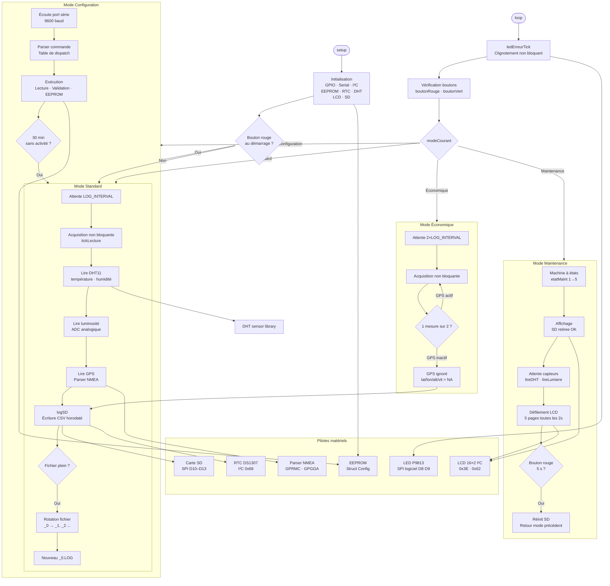

# Station Météo Embarquée — Arduino Uno

Système embarqué de collecte et d'enregistrement de données environnementales sur Arduino Uno. Il mesure température, humidité, luminosité et position GPS, les enregistre sur carte SD et les affiche sur un écran LCD.

---

## Table des matières

- [Fonctionnalités](#-fonctionnalités)
- [Matériel requis](#-matériel-requis)
- [Schéma de câblage](#-schéma-de-câblage)
- [Bibliothèques requises](#-bibliothèques-requises)
- [Modes de fonctionnement](#-modes-de-fonctionnement)
- [Signaux LED](#-signaux-led)
- [Format des données SD](#-format-des-données-sd)
- [Architecture du code](#-architecture-du-code)
- [Installation](#-installation)

---

## Fonctionnalités

- Acquisition de données : température, humidité (DHT11), luminosité (analogique), GPS (NMEA)
- Enregistrement horodaté sur carte SD (CSV, rotation automatique des fichiers)
- Affichage LCD I²C avec défilement de 5 pages de données
- Horloge RTC DS1307 pour l'horodatage
- LED RGB P9813 avec codes couleur par mode et signalisation d'erreurs
- Paramètres configurables et persistés en EEPROM
- 4 modes de fonctionnement accessibles par boutons

---

## Matériel requis

| Composant | Modèle / Référence | Quantité |
|---|---|---|
| Microcontrôleur | Arduino Uno (ATmega328P) | 1 |
| Capteur Temp/Humidité | DHT11 | 1 |
| Capteur de luminosité | Photorésistance / LDR sur A0 | 1 |
| Module GPS | UART NMEA (ex. NEO-6M) | 1 |
| Horloge temps réel | DS1307 (I²C) | 1 |
| Écran LCD | LCD 16×2 I²C (adresse 0x3E + RGB 0x62) | 1 |
| LED RGB | P9813 (Grove Chainable LED) | 1 |
| Carte SD | Module SPI (CS sur pin 10) | 1 |
| Bouton poussoir | Normalement ouvert | 2 |

---

## Schéma de câblage

| Pin Arduino | Composant | Signal |
|---|---|---|
| D2 | Bouton vert | Entrée (INPUT_PULLUP) |
| D3 | Bouton rouge | Entrée (INPUT_PULLUP) |
| D4 | DHT11 | Data |
| D8 | LED P9813 | CLK |
| D9 | LED P9813 | DATA |
| D10 | Module SD | CS (SPI) |
| D11 | Module SD | MOSI (SPI) |
| D12 | Module SD | MISO (SPI) |
| D13 | Module SD | SCK (SPI) |
| A0 | Photorésistance | Analogique |
| A4 — SDA | RTC DS1307 + LCD | I²C Data |
| A5 — SCL | RTC DS1307 + LCD | I²C Clock |
| RX (D0) | Module GPS | TX du GPS |

> Le module GPS utilise le port série matériel. Déconnecter le GPS lors du flashage.

---

## Bibliothèques requises

Installer via le Gestionnaire de bibliothèques Arduino IDE (Outils → Gérer les bibliothèques) :

| Bibliothèque | Version testée | Source |
|---|---|---|
| DHT sensor library — Adafruit | ≥ 1.4.7 | [GitHub](https://github.com/adafruit/DHT-sensor-library) |
| Adafruit Unified Sensor | ≥ 1.1.15 | [GitHub](https://github.com/adafruit/Adafruit_Sensor) |
| SD | incluse Arduino IDE | — |
| SPI | incluse Arduino IDE | — |
| Wire | incluse Arduino IDE | — |
| EEPROM | incluse Arduino IDE | — |

> Le LCD, le RTC et le GPS sont pilotés **sans bibliothèque externe** afin de minimiser l'empreinte mémoire.

---

## Modes de fonctionnement

### Mode Standard — LED verte 
Démarrage normal. Acquisition complète (DHT11, luminosité, GPS) à intervalle régulier (10 minutes par défaut). Toutes les mesures sont enregistrées sur la carte SD.

### Mode Économique — LED bleue 
Accessible depuis le mode standard en **maintenant le bouton vert 5 secondes**.
- L'intervalle entre mesures est **multiplié par 2**
- Le GPS n'est sollicité **qu'une mesure sur deux**
- Retour au mode standard : maintenir le **bouton rouge 5 secondes**

### Mode Maintenance — LED orange 
Accessible depuis le mode standard ou économique en **maintenant le bouton rouge 5 secondes**.
- L'écriture SD est **suspendue** — la carte peut être retirée et remplacée sans risque de corruption
- Les données des capteurs sont affichées en direct sur le LCD (défilement automatique toutes les 2 secondes)
- Retour au mode précédent : maintenir le **bouton rouge 5 secondes**

### Mode Configuration — LED jaune 
Activé au **démarrage** en maintenant le bouton rouge enfoncé.
- Interface de commande via le port série à 9600 baud
- Paramètres enregistrés en EEPROM, persistants après redémarrage
- Retour automatique en mode standard après **30 minutes** d'inactivité

#### Commandes disponibles

| Commande | Description | Domaine | Défaut |
|---|---|---|---|
| `VERSION` | Affiche la version du firmware et le numéro de lot | — | — |
| `RESET` | Réinitialise tous les paramètres | — | — |
| `LOG_INTERVAL=` | Intervalle entre mesures (minutes) | 1 – 1440 | 10 |
| `FILE_MAX_SIZE=` | Taille max d'un fichier log (octets) | 512 – 65535 | 2048 |
| `TIMEOUT=` | Délai avant abandon d'un capteur (secondes) | 1 – 300 | 30 |
| `LUMIN=` | Activer / désactiver la luminosité | 0 ou 1 | 1 |
| `LUMIN_LOW=` | Seuil luminosité "faible" | 0 – 1023 | 255 |
| `LUMIN_HIGH=` | Seuil luminosité "forte" | 0 – 1023 | 768 |
| `TEMP_AIR=` | Activer / désactiver la température | 0 ou 1 | 1 |
| `MIN_TEMP_AIR=` | Seuil bas température (°C) | -40 – 85 | -10 |
| `MAX_TEMP_AIR=` | Seuil haut température (°C) | -40 – 85 | 60 |
| `HYGR=` | Activer / désactiver l'hygrométrie | 0 ou 1 | 1 |
| `HYGR_MINT=` | Température min pour la prise en compte hygro (°C) | -40 – 85 | 0 |
| `HYGR_MAXT=` | Température max pour la prise en compte hygro (°C) | -40 – 85 | 50 |
| `PRESSURE=` | Activer / désactiver la pression (réservé) | 0 ou 1 | 1 |
| `PRESSURE_MIN=` | Seuil bas pression (hPa) | 300 – 1100 | 850 |
| `PRESSURE_MAX=` | Seuil haut pression (hPa) | 300 – 1100 | 1080 |
| `CLOCK=HH:MM:SS` | Régler l'heure du RTC | — | — |
| `DATE=MM,DD,YYYY` | Régler la date du RTC | — | — |
| `DAY=MON\|TUE\|...` | Régler le jour de la semaine | MON … SUN | — |

---

## Signaux LED

| Couleur / Clignotement | État |
|---|---|
| 🟢 Vert continu | Mode standard |
| 🔵 Bleu continu | Mode économique |
| 🟡 Jaune continu | Mode configuration |
| 🟠 Orange continu | Mode maintenance |
| 🔴↔🔵 Rouge / Bleu 1 Hz égal | Erreur d'accès à l'horloge RTC |
| 🔴↔🟡 Rouge / Jaune 1 Hz égal | Erreur GPS (timeout) |
| 🔴↔🟢 Rouge / Vert 1 Hz égal | Erreur capteur (timeout ou données hors limites) |
| 🔴↔⚪ Rouge / Blanc 1 Hz égal | Carte SD pleine |
| 🔴↔⚪ Rouge / Blanc — blanc 2× plus long | Erreur d'écriture ou d'accès SD |

---

## Format des données SD

Les fichiers sont nommés selon le format **AAMMJJ_R.LOG** (ex. `250531_0.LOG` pour le 31 mai 2025, révision 0).

Le système écrit toujours dans le fichier de révision `_0`. Quand il atteint `FILE_MAX_SIZE`, ce fichier est archivé avec la prochaine révision disponible (`_1`, `_2`…) et l'écriture repart depuis le début de `_0`.

**En-tête CSV :** `timestamp, hum, temp, lum, lat, lon, alt, vit`

| Colonne | Unité | Remarque |
|---|---|---|
| timestamp | YYYY-MM-DD HH:MM:SS | NA si RTC absent |
| hum | % | Humidité relative |
| temp | °C | Température air |
| lum | 0 – 1023 | Valeur brute ADC |
| lat / lon | degrés décimaux | NA si GPS en timeout |
| alt | m | Altitude GPS |
| vit | m/s | Vitesse GPS |

---

## Architecture du code

---

## Licence

Ce projet est à usage éducatif — [CESI École d'Ingénieurs](https://www.cesi.fr).
